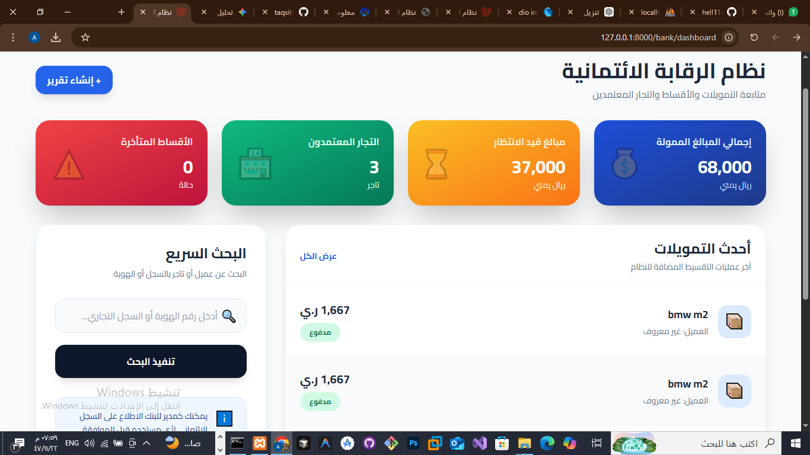
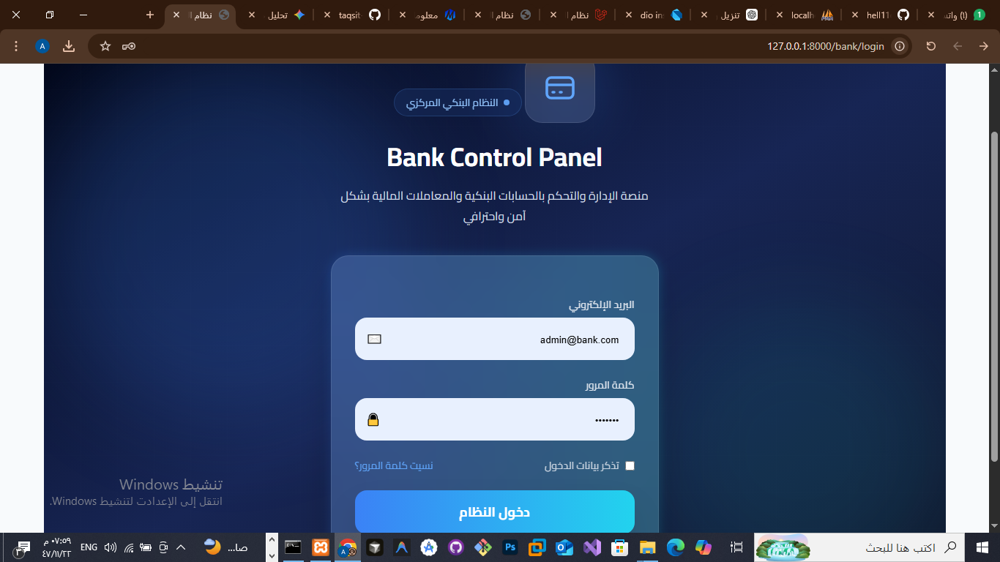
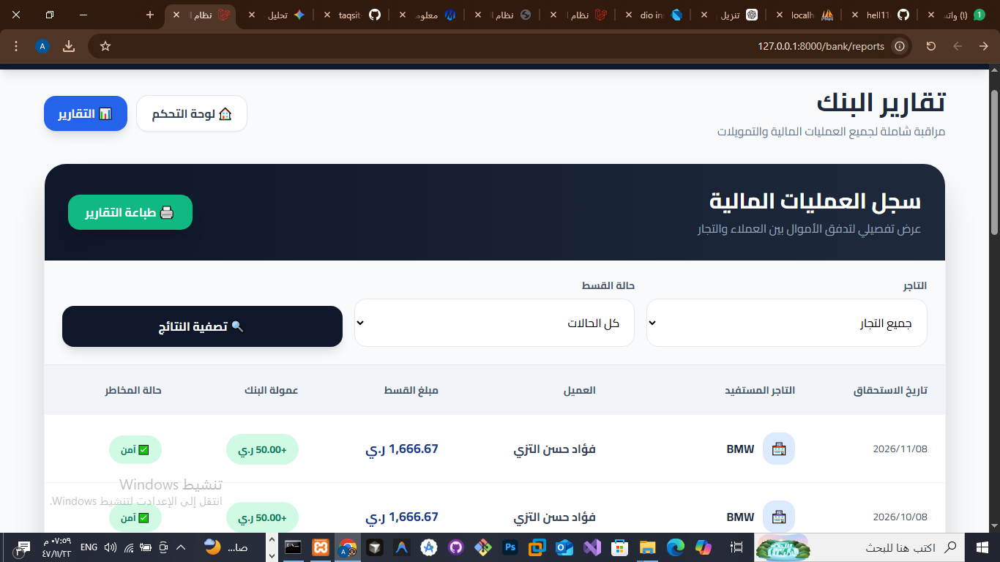
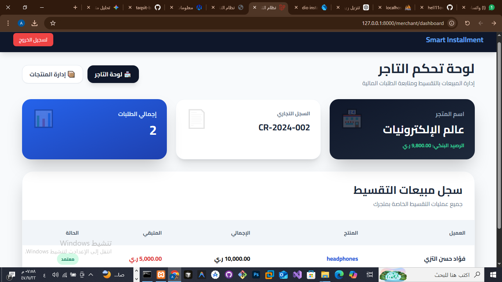
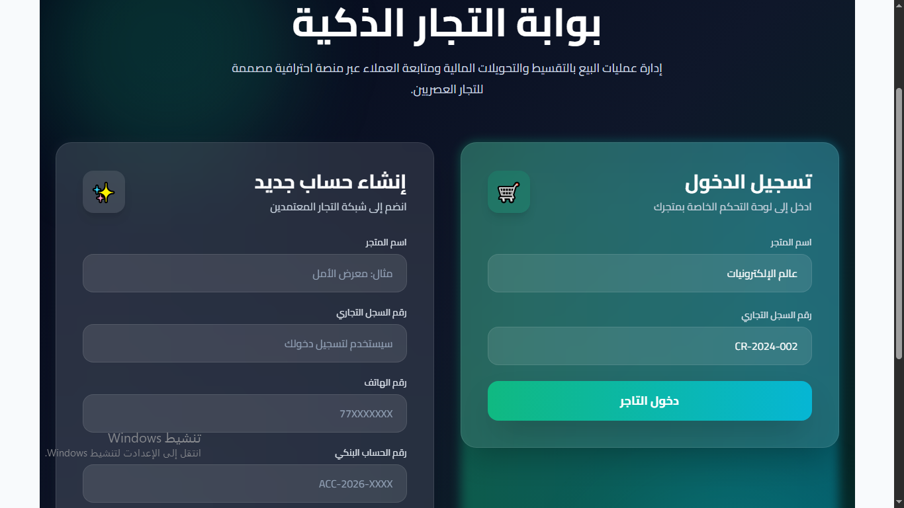
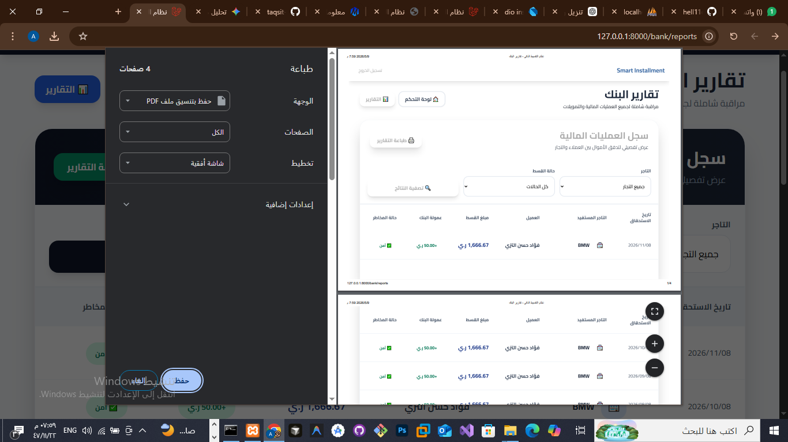

# 💳 TaqsitApp - Enterprise FinTech Backend Solution
### *نظام متكامل لإدارة التمويل الأصغر والتقسيط الذكي*

[](https://laravel.com)
[](https://php.net)
[](https://mysql.com)
[](https://restfulapi.net)

---

## 📖 حول المشروع (About the Project)
**TaqsitApp Backend** هو المحرك المالي لنظام تقسيط حديث. لا يقتصر المشروع على تسجيل الدفعات فحسب، بل يقوم بدور "الوسيط المالي الذكي" بين التاجر والعميل، حيث يقوم بتحليل البيانات البنكية للمستخدم وتحديد أهليته للشراء بالتقسيط بناءً على خوارزميات داخلية لتقييم المخاطر.

### 🌟 الميزات الرئيسية (Core Features)
1. **التحقق الثنائي للهوية (Secure Auth):** نظام دخول آمن يعتمد على رقم الهاتف كمعرف فريد، مع تشفير كامل لكلمات المرور.
2. **محرك الجدارة الائتمانية (Credit Scoring Engine):** يقوم النظام بحساب "السكور" لكل عميل. كلما زاد التزام العميل بالسداد، ارتفع السكور الخاص به، مما يرفع "الحد الائتماني" (Installment Limit) المتاح له.
3. **الإدارة المالية الآلية (Automated Finance):** - خصم تلقائي من الرصيد البنكي الافتراضي عند سداد القسط.
   - تحديث لحظي للديون المتبقية.
4. **نظام الإشعارات البرمجي:** توفير نقاط اتصال (Endpoints) تتيح لتطبيق الفلاتر معرفة مواعيد الأقساط المتأخرة.
5. **كتالوج المنتجات الذكي:** عرض المنتجات مع حساب قيمة القسط الشهري لكل منتج بناءً على عدد الأشهر المتاحة.

---

## 🏗 المعمارية الهندسية (Technical Architecture)

### 1. طبقة البيانات (Data Layer)
تم استخدام **Eloquent ORM** مع تطبيق نظام **Soft Deletes** لضمان عدم ضياع السجلات المالية عند الحذف.

### 2. تدفق العمليات (Business Logic Flow)
* **عملية الشراء:** 1. التحقق من رصيد العميل.
  2. التأكد من أن سعر المنتج لا يتجاوز "الحد الائتماني" للعميل.
  3. إنشاء جدول أقساط (Installment Schedule) مقسم على شهور.
  4. حجز المبلغ وتحديث حالة الحساب.

---

## 🛠 المواصفات التقنية (Technical Specifications)

| الميزة | التقنية المستخدمة |
| :--- | :--- |
| **Authentication** | Laravel Sanctum (Stateful & Stateless) |
| **Data Validation** | Form Request Validation (Separate Layer) |
| **API Response** | Standardized JSON Response (Success/Error) |
| **Error Handling** | Global Exception Handler |
| **Security** | Mass Assignment Protection & SQLi Prevention |

---

## 📊 هيكلية قاعدة البيانات (Database Schema)

* **`users`**: تخزين بيانات الوصول (الاسم، الهاتف، الباسورد).
* **`banks`**: (رصيد الحساب، الحد الائتماني، سكور العميل).
* **`products`**: (الاسم، الوصف، السعر الأصلي، السعر بعد الفائدة).
* **`installments`**: (المبلغ الكلي، المبلغ المدفوع، تاريخ الاستحقاق، الحالة: مدفوع/متأخر).

---

## 🚀 دليل التشغيل المتقدم (Advanced Installation)

### 1. إعداد البيئة وتثبيت الاعتمادات
```bash
composer install
cp .env.example .env
php artisan key:generate


# 🚀 Smart Installment System (Backend API)


---

## 📌 Overview

Smart Installment System is a backend API built with Laravel that manages a complete installment-based payment system between:

* 👤 Customers
* 🏪 Merchants
* 🏦 Banks

The system supports product purchases, installment plans, payments tracking, and financial transactions.

---

## ✨ Features

* 🔐 Authentication system (Users / Merchants / Banks)
* 🛒 Product management
* 💳 Installment payment system
* 📊 Transaction tracking
* 📦 Order management
* 📡 RESTful API architecture
* 📮 Postman collection included
* 🗄️ Database seeding system

---

## 🧱 Tech Stack

* Laravel 10
* PHP 8+
* MySQL
* Sanctum Authentication
* REST API

---

## 📸 Screenshots


### Dashboard



### Merchant Panel



### API Flow









---

## ⚙️ Installation

```bash id="inst1"
composer install
```

```bash id="inst2"
cp .env.example .env
```

```bash id="inst3"
php artisan key:generate
```

```bash id="inst4"
php artisan migrate --seed
```

```bash id="inst5"
php artisan serve
```

---

## 📮 API Documentation (Postman)

📁 Collection:

```
/postman/Smart Installment API.postman_collection.json
```

📁 Environment:

```
/postman/Smart Installment - Dev.postman_environment.json
```

---

## 📖 Swagger API (Optional Professional Setup)

إذا تريد تشغيل Swagger داخل Laravel:

### 1. تثبيت Swagger:

```bash id="swg1"
composer require darkaonline/l5-swagger
```

### 2. نشر الإعدادات:

```bash id="swg2"
php artisan vendor:publish --provider "L5Swagger\L5SwaggerServiceProvider"
```

### 3. توليد التوثيق:

```bash id="swg3"
php artisan l5-swagger:generate
```

### 4. فتح Swagger UI:

```
http://127.0.0.1:8000/api/documentation
```

---

## 🗄️ Database

SQL file included:

```
databasefromPHPmyadmin/smart_installment_db.sql
```

---

## 📂 Project Structure

```
app/
 ├── Http/Controllers/
 ├── Models/
database/
 ├── migrations/
 ├── seeders/
routes/
 ├── api.php
postman/
public/
```

---

## 👨‍💻 Developer

Final Year Project – Smart Installment System
Built with Laravel Backend Architecture

---

## ⭐ Future Improvements

* Mobile App (Flutter)
* Admin Dashboard UI
* Payment Gateway Integration
* Notifications System
